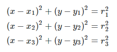
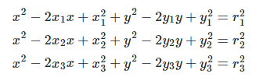
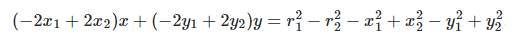
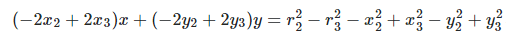
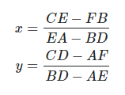
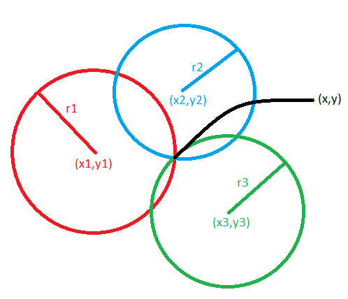

# Quasar Challenge

## Desafío 

Como jefe de comunicaciones rebelde, tu misión es crear un programa en Golang que retorne la fuente y contenido del mensaje de auxilio. Para esto, cuentas con tres satélites que te permitirán triangular la posición, ¡pero cuidado! el mensaje puede no llegar completo a cada satélite debido al campo de asteroides frente a la nave. 

#### Posición de los satélites actualmente en servicio 
* Kenobi: [-500, -200] 
* Skywalker: [100, -100] 
* Sato: [500, 100]

#### Nivel 1 
##### Crear un programa con las siguientes firmas: 

```
// input: distancia al emisor tal cual se recibe en cada satélite 
// output: las coordenadas ‘x’ e ‘y’ del emisor del mensaje
func GetLocation(distances ...float32) (x, y float32) 
// input: el mensaje tal cual es recibido en cada satélite 
// output: el mensaje tal cual lo genera el emisor del mensaje 
func GetMessage(messages ...[]string) (msg string) 
```

> La biblioteca que contiene el decoder _Decoder.Logic_ está desarrollada en C#. La REST API está desarrollada en ASPTNET CORE en el proyecct Decoder.REST. Las firmas de los métodos quedaron de la siguiente manera:
>
> `public (double x, double y) GetLocation(double[] distances)`
>
> `public string GetMessage(string[][] messages)`

###### Consideraciones: 
* La unidad de distancia en los parámetros de GetLocation es la misma que la que se utiliza para indicar la posición de cada satélite. 
* El mensaje recibido en cada satélite se recibe en forma de arreglo de strings.
* Cuando una palabra del mensaje no pueda ser determinada, se reemplaza por un string en blanco en el array. 
* Ejemplo: [“este”, “es”, “”, “mensaje”] 
* Considerar que existe un desfasaje (a determinar) en el mensaje que se recibe en cada satélite. 
* Ejemplo: 
	* Kenobi: [“”, “este”, “es”, “un”, “mensaje”] 
	* Skywalker: [“este”, “”, “un”, “mensaje”] 
	* Sato: [“”, ””, ”es”, ””, ”mensaje”]

##### Estrategia y resolución

###### Calculo de la posición relativa a los satélites.

Como la posición de los satélites y la distancia desde el objeto a los mismos es conocida se puede usar la fórmula de trilateración (similar a triangulación pero esta usa distancia en lugar de ángulos). Que se calculó de la siguiente manera:

Paso 1:
- Se obtiene la fórmula de los círculos: 


- Expandimos los cuadrados: 


- Restamos a la primer ecuación la segunda: 


- A la segunda le extraemos la tercera: 


- Re-escribimos la ecuación usando A, B, C, D, E, F: 


- Resolvemos el sistema: 



Esta fórmula nos debería ayudar a buscar encontrar la nave enemiga.



###### Decodificación del mensaje

Para la decodificación del mensaje me base en muchas consideraciones que enumero más abajo. Básicamente reviso cada posición de los vectores con texto y comparo por igual posición. Si es lo mismo o todos los demás están vacíos lo agrego a una cola de mensajes. Una vez completado el proceso desencolo los mensajes para formar el mensaje final.

##### Consideraciones

* Asumo que siempre voy a disponer de la información inicial de los 3 satélites.
* Asumo que el desfasaje siempre ocurre en la primera posición de los vectores o al final.

#### Nivel 2

Crear una API REST, hostear esa API en un cloud computing libre (Google App Engine, Amazon AWS, etc), crear el servicio /topsecret/ en donde se pueda obtener la ubicación de la nave y el mensaje que emite.
El servicio recibirá la información de la nave a través de un HTTP POST con un payload con el siguiente formato: 
```
POST → /topsecret/ 
{ 
	"satellites": [ 
			{ 
				“name”: "kenobi", 
				“distance”: 100.0, 
				“message”: ["este", "", "", "mensaje", ""] 
			}, 
			{ 
				“name”: "skywalker", 
				“distance”: 115.5 
				“message”: ["", "es", "", "", "secreto"] 
			}, 
			{ 
				“name”: "sato", 
				“distance”: 142.7 
				“message”: ["este", "", "un", "", ""] 
			} 
		] 
} 
La respuesta, por otro lado, deberá tener la siguiente forma: 

RESPONSE CODE: 200 
{ 
	"position": { 
		"x": -100.0, 
		"y": 75.5 
	}, 
	"message": "este es un mensaje secreto" 
} 
```
_*Nota*_: la respuesta en este ejemplo es meramente ilustrativa y no debe ser considerada como caso de prueba para validar la solución propuesta. 
En caso que no se pueda determinar la posición o el mensaje, retorna: 
`RESPONSE CODE: 404`

##### Estrategia y resolución

###### Creación de la aplicación REST API.

La aplicación esta creada utilizando como framework **ASPNET CORE 3.1**. Como consideraciones a tener en cuenta la misma soporta CORS en todos los origins y para todos los methods. Lo hice de esta manera para hacerlo más general.
Para manejar la seguridad utilizo un custom middleware para la creación y validación del token _JWT_.

La REST API se deploya automáticamente cada vez que un push sobre el branch _main_. El deploy se realiza utilizando las acciones de _Github_. La acción compila la versión actual y la deploya en __Azure__ en la siguiente url: _*https://demo-br-dev-rest.azurewebsites.net*_

###### Como consumir la API.

Para consumir el endpoint solicitado en el ejercicio uno primero debe obtener un token para validar la identidad. Los pasos para poder ejecutar correctamente la aplicación son los siguientes:

- Hacer un POST al endpoint `https://demo-br-dev-rest.azurewebsites.net/api/users/authenticate`
> El body debe ser el siguiente json donde se pasa el usuario `hsolo` y pass `chewbacca`.
```
{
    "username":"hsolo",
    "password":"chewbacca"
}
```
> Este endpoint va a validar el usuario y password y va a generar un token JWT que debe ser utilizado para consumir el resto de los endpoints pasándolo como Autorization header
> Como se muestra a continuación: `Key: Authorization, Value: Bearer *****JWT*****`

- Segun lo solicitado en el ejercicio el post se debe hacer al siguiente endpoint `https://demo-br-dev-rest.azurewebsites.net/api/decoder/topsecret`
> No olvidar agregar el header mencionado en el paso anterior.

##### Consideraciones

* La configuración inicial de la clase decoder se toma de la configuración de la aplicación REST.
* Asumo que la cantidad de satélites que se envían en el post debe ser la misma que se tiene configurado caso contrario la REST devuelve `status code 400`.
* Si ocurriera alguna excepción durante la ejecución la REST devuelve un mensaje con `status code 500`.

#### Nivel 3

Considerar que el mensaje ahora debe poder recibirse en diferentes POST al nuevo servicio /topsecret_split/, respetando la misma firma que antes. Por ejemplo: 
```
POST → /topsecret_split/{satellite_name} 
{ 
	"distance": 100.0, 
	"message": ["este", "", "", "mensaje", ""] 
} 
```
Crear un nuevo servicio /topsecret_split/ que acepte POST y GET. En el GET la respuesta deberá indicar la posición y el mensaje en caso que sea posible determinarlo y tener la misma estructura del ejemplo del Nivel 2. Caso contrario, deberá responder un mensaje de error indicando que no hay suficiente información.

##### Estrategia y resolución

###### Como consumir la API.

Igual que en el paso anterior antes de consumir el endpoint `https://demo-br-dev-rest.azurewebsites.net/api/topsecret_split/{satellite_name}` el usuario se deberá autenticar (o utilizar un token valido). Para llamar ambos verbos _GET o POST_

##### Consideraciones

* Casos con los cuales la REST devuelve `status code 400` en el POST:
	* En caso de que el body del POST sea null
	* En caso de que el nombre del satélite sea null o vacío.
	* En caso de que el nombre del satélite no corresponda con los configurados en la REST.
* Si ocurriera alguna excepción durante la ejecución la REST devuelve un mensaje con `status code 500` tanto en el _GET como el POST_.
* Casos en los cuales la REST devuelve `status code 400` en el GET:
	* No se encuentra en la REST toda la información de los satélites configurados.
	* Pese a que se encuentra la información de todos los satélites, algunos datos faltan.
	* No se puede calcular la posición o el mensaje.
