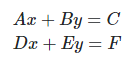

# Quasar Challenge

## Desafío 

Como jefe de comunicaciones rebelde, tu misión es crear un programa en Golang que retorne la fuente y contenido del mensaje de auxilio. Para esto, cuentas con tres satélites que te permitirán triangular la posición, ¡pero cuidado! el mensaje puede no llegar completo a cada satélite debido al campo de asteroides frente a la nave. 

#### Posición de los satélites actualmente en servicio 
* Kenobi: [-500, -200] 
* Skywalker: [100, -100] 
* Sato: [500, 100]

#### Nivel 1 
##### Crear un programa con las siguientes firmas: 

```
// input: distancia al emisor tal cual se recibe en cada satélite 
// output: las coordenadas ‘x’ e ‘y’ del emisor del mensaje
func GetLocation(distances ...float32) (x, y float32) 
// input: el mensaje tal cual es recibido en cada satélite 
// output: el mensaje tal cual lo genera el emisor del mensaje 
func GetMessage(messages ...[]string) (msg string) 
```

> La biblioteca que contiene el decoder _Decoder.Logic_ está desarrollada en C#. La REST API está desarrollada en ASPTNET CORE en el proyecct Decoder.REST. Las firmas de los métodos quedaron de la siguiente manera:
> `public (double x, double y) GetLocation(double[] distances)`
> `public string GetMessage(string[][] messages)`

###### Consideraciones: 
* La unidad de distancia en los parámetros de GetLocation es la misma que la que se utiliza para indicar la posición de cada satélite. 
* El mensaje recibido en cada satélite se recibe en forma de arreglo de strings.
* Cuando una palabra del mensaje no pueda ser determinada, se reemplaza por un string en blanco en el array. 
* Ejemplo: [“este”, “es”, “”, “mensaje”] 
* Considerar que existe un desfasaje (a determinar) en el mensaje que se recibe en cada satélite. 
* Ejemplo: 
	* Kenobi: [“”, “este”, “es”, “un”, “mensaje”] 
	* Skywalker: [“este”, “”, “un”, “mensaje”] 
	* Sato: [“”, ””, ”es”, ””, ”mensaje”]

##### Estrategia y resolución

###### Calculo de la posición relativa a los satélites.

Como la posición de los satélites y la distancia desde el objeto a los mismos es conocida se puede usar la fórmula de trilateración (similar a triangulación pero esta usa distancia en lugar de ángulos). Que se calculó de la siguiente manera:

Paso 1:
- Se obtiene la fórmula de los círculos: 

- Expandimos los cuadrados: 

- Restamos a la primer ecuación la segunda: 

- A la segunda le extraemos la tercera: 

- Re-escribimos la ecuación usando A, B, C, D, E, F: 

- Resolvemos el sistema: 


Esta fórmula nos debería ayudar a buscar encontrar la nave enemiga.


###### Decodificación del mensaje

Para la decodificación del mensaje me base en muchas consideraciones que enumero más abajo. Básicamente reviso cada posición de los vectores con texto y comparo por igual posición. Si es lo mismo o todos los demás están vacíos lo agrego a una cola de mensajes. Una vez completado el proceso desencolo los mensajes para formar el mensaje final.

##### Consideraciones

* Asumo que siempre voy a disponer de la información inicial de los 3 satélites.
* Asumo que el desfasaje siempre ocurre en la primera posición de los vectores o al final.


